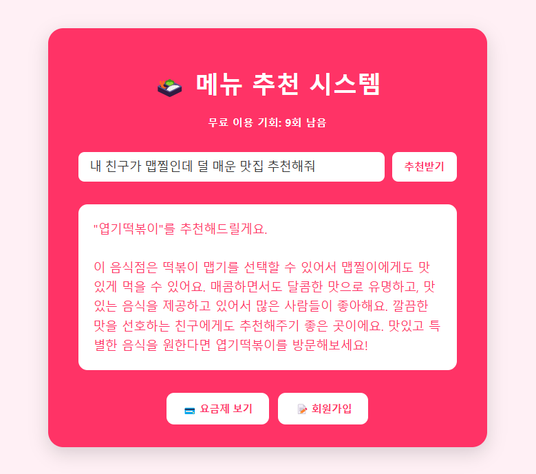
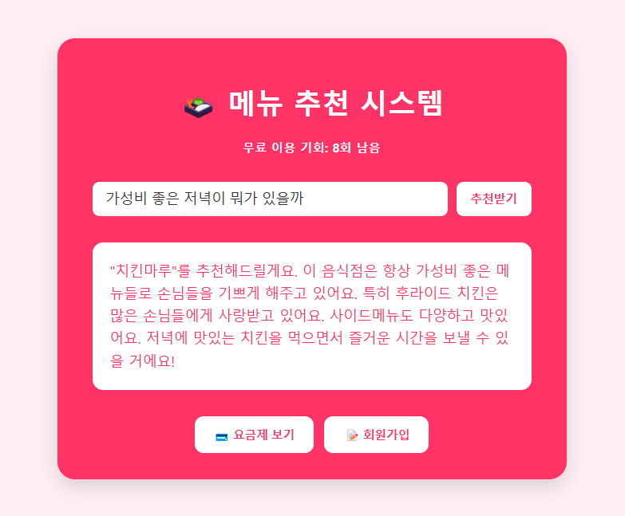
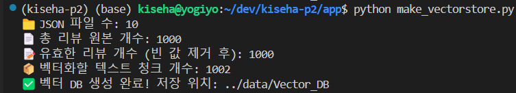
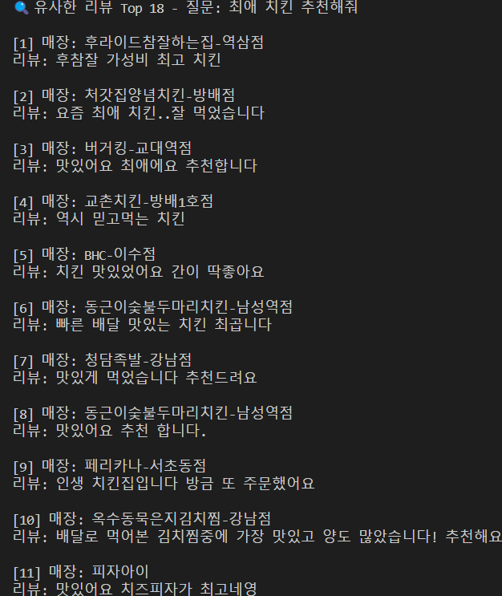

# 🍱 요기요 AI 음식 추천 시스템

**GPT + FAISS + 요기요 리뷰 데이터 기반의 실전형 음식점 추천 시스템**입니다.  
사용자의 질문에 따라, GPT가 **"가장 적합한 음식점 1가지"만 정적으로 추천**합니다.

> 🤖 LangChain 기반 RAG 구조 + FastAPI 백엔드 + React 프론트엔드까지 구현된 풀스택 AI 추천 서비스

---

## 기획서 
[📄 기획서 보기](PROJECT_PROPOSAL.md)


---

## 💻 시연 영상

▶️ [요기요 추천 시스템 시연 영상 보기 (YouTube)](https://youtube.com/shorts/ePoe-GW0KoI?feature=share)


---

## 🖼️ 주요 화면

| 화면 구분 | 이미지 |
|-----------|--------|
| 🧭 초기 접속 화면 |  |
| 💬 GPT 추천 결과 (1) |  |
| 💬 GPT 추천 결과 (2) |  |
| 🧠 FAISS 벡터 DB 생성 완료 |  |
| 🧪 FAISS 검색 결과 검증 |  |


---

## 🔍 작동 방식 요약

```
사용자 질문 → FAISS 유사 리뷰 검색 (RAG) → GPT에게 context 전달 → 음식점 1가지 추천 + 이유
```

---

## 🕷️ 리뷰 데이터 수집 과정

- `test/yogiyo_auto_reviews.py`를 통해 **Selenium**으로 요기요 리뷰 수집
- 주소 입력 → 음식점 리스트 지입 → 클린리뷰 탭 → 리뷰 “더 보기” 반복 클릭
- 음식점 이름 + 리뷰 텍스트를 JSON 형태로 저장

### ✅ 예시 JSON 구조

```json
[
  {
    "store": "버거킹-서초점",
    "review": "햄버거 고기 패티가 두투른하고 배달도 빠른데요!"
  },
  {
    "store": "교초치킹-강남점",
    "review": "양념 맛있어요~ 또 시킵보게요!"
  }
]
```

> 저장 위치: `data/DB/yogiyo_reviews_result1_0.json` 등

---

## 🧠 벡터 DB 생성

- 리뷰 데이터를 LangChain `Document`로 변환
- `RecursiveCharacterTextSplitter`로 문서 분할
- `OpenAIEmbeddings`를 사용해 벡터화
- `FAISS`를 사용해 저장

### 🧠 생성 스크립트

```bash
python app/make_vectorstore.py
```

> 결과 저장 경로: `data/Vector_DB/index.faiss`, `index.pkl`

---

## ⚙️ 실행 방법

### ✅ 백엔드 (FastAPI)

```bash
uvicorn app.main:app --reload
```

### ✅ 프론트엔드 (React)

```bash
cd frontend
npm install
npm start
```

→ 브라우저에서 `http://localhost:3000` 접속

---

## 📂 폴더 구조

```bash
kiseha-yogiyo-ai-recommendation/
|
├── app/                         # 🔧 FastAPI 서버 + 벡터 DB 생성
│   ├── main.py                  # GPT 추천 API
│   ├── make_vectorstore.py      # JSON 리뷰 → FAISS 벡터 DB
│   └── test_vectorstore.py      # 유사 리뷰 검색 테스트
│
├── data/
│   ├── DB/                      # 📄 클롤링된 리뷰 원본 JSON
│   └── Vector_DB/               # 🧠 FAISS 벡터 인덱스
│
├── frontend/                    # 🎨 React 기반 사용자 UI
│   ├── public/
│   ├── src/
│   │   └── App.jsx              # GPT 추천 UI
│   └── package.json             # 프론트 설정
│
├── test/                        # 💡 클롤링 테스트 스크립트 목록
│   └── yogiyo_auto_reviews.py   # ✅ 최종 클롤링 성공 스크립트
│
├── .env                         # 🔐 OpenAI API 키 (Git에는 제출 X)
├── .gitignore                   # Git 추적 제외 설정
└── README.md                    # 📘 이 파일
```

---

## 💡 사용 기술 스택

| 번류 | 기술 |
|------|------|
| AI | OpenAI GPT-3.5, LangChain (RetrievalQA) |
| 벡터 DB | FAISS + OpenAIEmbeddings |
| 백엔드 | FastAPI |
| 프론트 | React + Vite |
| 크롤링 | Selenium |
| 기타 | dotenv, JSON 데이터, npm, uvicorn |

---

## 🔒 보안 주의사항

`.env` 파일은 다음과 같이 구성되며, **절대 GitHub에 올리지 않아야 합니다.**

```env
OPENAI_API_KEY=sk-xxxxxxxxxxxxxxxxxxxxxxxx
```

---

## 🚀 향후 확장 방향

- 📍 위치 기반 프리서 추가
- 📈 리뷰 감성 분석 + 시각화
- 🧾 음식점 상세 리뷰 요약 기능
- 🧠 사용자 취향 기억 기능 (Login/센션 기반)

---

## 🧑‍💻 개발자

**KISEHA**  
> GPT + AI 응용 서비스 실전 개발자  
> 크롤링부터 벡터화, RAG 추천 시스템까지 직접 구현한 풀사이클 메이커

---
